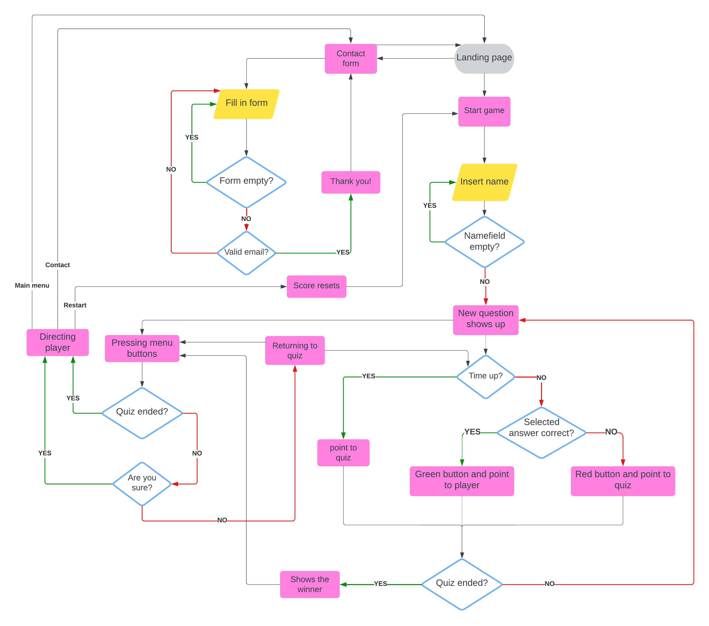

# Hockeyquiz

### A quiz with questions of the fantastic quiz och hockey!
I want this quiz to be fun and not be questions about the quiz and the rules of the quiz. This will be a quiz about unique happenings that occur on or off the rink during a hockeyquiz. So even the people that have a lot of knowledge of the quiz of hockey will have a challenge. 

[User Stories](#user-stories) 
[Wireframes](#wireframes) 
[Testing](#testing) 
[Bugs](#bugs) 
[Resources](#resources)

# User stories
- **Main page:** As a visiting user I will be presented what type of quiz this is and have the possibility to either start the quiz or contact the creator.
- **Start quiz** As a visitung user I will be inserting my name before the quiz starts.
- **Contact:** As a visiting user I want to share my feedback to the creator.
- **quiz pages:** As a visiting user I´m being presented the question and 4 alternatives as answers, when pressing an answer I will be presented if I choose right or wrong. When I´m playing the quiz there´s also possibilities to cancel the quiz by pressing "Main menu". When pressing the button I will be asked if I´m really sure to exit or not.

# Features

- ### **Main page:** 
Here the user will find instruction on how this quiz works.  From this page the user can also navigate to main page and contact by clicking the buttons in the footer. 
**Why did I only place the "Play"-button only on the main page?** - I want the user to read the instructions before they start the quiz.  
 

- ### **Contact page:** 
Here the user will find: - form to submit feedback about the quiz - Links to social media of the creator. 
From this page the user can only navigate to the main page by clicking the button in the footer.

- ### **Start the quiz page:** 
Here the quiz wants the user to fill in their name so that can be on the scoreboard when the quiz starts. 
From this page the user can also navigate to main page and contact by clicking the buttons in the footer.

- ### **Quiz page:** 
When the quiz starts a question will be shown, timer will count down from 30 seconds and 4 answering buttons will be shown. 
The name the user put in before will be shown at the scoreboard. 
The score updates when a question has been answered or the timer runs out 
Now their are a restart button visible between "Main menu" and "Contact".  Clicking on one of these 3 buttons (Main menu/Restart/Contact) during the quiz will ask the user if really want to leave? If the match has ended there will be no question asking the user if they want to leave. 
When the quiz has ended the user will get a message if they won or lost the match against the quiz 
  

   

# Wireframes
Here are my first blueprints on how I wanted this quiz to look. The finished quiz looks pretty similar to how I wanted it to look.  
 
 
 

# Testing
`Home Page`

| Feature | Expected Outcome | Testing Performed | Result | Pass/Fail |
| --- | --- | --- | --- | --- |
| Contact button | Directed to contact page | Clicked on Contact | Contact page was loaded | Pass |
| Main menu button | No other page shall be visual | Clicked on Main menu | Nothing happened | Pass |
| Play button | Directed to name input page | Clicked on Play | Name input was loaded | Pass |

`Name input`

| Feature | Expected Outcome | Testing Performed | Result | Pass/Fail |
| --- | --- | --- | --- | --- |
| Leaving namefield empty | Message be shown when left empty | Left the field empty and clicked Start! | Message told me to fill in my name | Pass |
| Start the quiz | Question should be displayed when I have filled in a name | Filled in a name and clicked Start! | A question was shown and the quiz started | Pass |
| Main menu | Directed back to home page | Clicked on Main menu | Home page was loaded | Pass | 
| Contact | Directed to contact page | Clicked on Contact | Pass |

`Quiz page`

| Feature | Expected Outcome | Testing Performed | Result | Pass/Fail |
| --- | --- | --- | --- | --- |
| Name to scoreboard | The name I filled in before starting  shall be visual on scoreboard | Filled in a name and clicked start | The name was on the scoreboard vs. quiz | Pass |
| Timer start countdown from 30 | When quiz starts, the timer shall begin at 30 | Clicked start  | When quiz started the timer started at 30 | Pass |
| Question displays | When quiz starts a random question from the array shall be shown with answer options | Clicked start | A random question from the array  was displayed when quiz started | Pass
| Answering right | - Timer shall stop  - Only selected answer shall change color (green)  - Point to user - All answers shall be blocked - Button for next question shall be visible | Clicked on right answer | - Timer stopped  - Answer changed to green  - Point was given to user - All answered was blocked - Button for next question was shown | Pass |
| Answering wrong | - Timer shall stop  - Only selected answer shall change color (red)  - Point to quiz - All answers shall be blocked - Button for next question shall be visible | Clicked on wrong answer | - Timer stopped  - Answer changed to red  - Point was given to quiz - All answered was blocked - Button for next question was shown | Pass |
| Timer runs out | - All answer should be blocked - Point to quiz - Button for next question shall be visible | Let the timer run out | - All answer was blocked - Point was given to the quiz - Button for the next question was shown | Pass |
| Quiz stops after 11th question | Since there is more question in the array than 11,  button for next question shall not be shown  when answered the 11th question | Answered 11th question | Button for next question wasn´t shown | Pass |
| Winning against the quiz | Score more than the quiz and a win message shall be shown | Won against the quiz | Message that I won the quiz against the quiz | Pass |
| Loosing to the quiz | Score less than the quiz and a loss message shall be shown | Loosing to the quiz | Message that I lost to the quiz | Pass |
| Main menu (during the quiz) | If 11 questions haven´t been answered: I will be asked if I´m sure to leave? Answering yes will direct me back to main menu. Cancelling should bring me back to the quiz. | Clicked Main menu  (during the quiz) | I was asked to leave the quiz or not Clicked yes and was directed back to the main menu Cancelled the message and the quiz continued | Pass |
| Main menu (quiz ended) | When 11 questions have been answered: I won´t be asked to leave and directed back to main menu | Clicked Main menu  (when quiz finished) | I wasn´t asked to leave the quiz and got back to main menu | Pass |
| Contact (during the quiz)| If 11 questions haven´t been answered  I will be asked if I'm sure to leave Answering yes will direct me to the contact page Cancelling should bring me back to the quiz | Clicked Contact  (during the quiz) | I was asked to leave the quiz or not Clicked yes and was directed to the contact page Cancelled the message and the quiz continued | Pass |
| Contact (quiz ended)| When 11 questions have been answered  I won´t be asked if I'm sure to leave. | Clicked Contact  (when quiz ended) | I wasn´t asked to leave the quiz and the contact page was shown | Pass |
| Restart (during the quiz) | If 11 questions haven´t been answered  I will be asked if I´m sure to leave Answering yes will restart the quiz Cancelling should bring me back to the quiz | Clicked Restart  (during the quiz) | I was asked to leave the quiz or not Clicked yes and the quiz restarted with the scoreboard reset Cancelled the message and the quiz continued | Pass |
| Restart (quiz ended) | If 11 questions have been answered  I won´t be asked if I´m sure to leave and the quiz shall restart | Clicked Restart  (quiz ended) | I wasn´t asked to leave the quiz or not  and the quiz restarted with the scoreboard reset | Pass |

`Contact page`

| Feature | Expected Outcome | Testing Performed | Result | Pass/Fail |
| --- | --- | --- | --- | --- |
| Facebook link | When clicking on the facebook symbol: the profile of the maker will be shown in a new window | Clicked on the facebook logo | The facebookprofile of the creator was opened in a new window | Pass |
| Instagram link | When clicking on the facebook symbol: the profile of the maker will be shown in a new window | Clicked on the instagram logo | The instagramprofile of the creator was opened in a new window | Pass |
| Name input | Check if namefield has been filled  If empty a message will be shown and tell the field was empty | Left the namefield empty and press send | A message told me to fill in the name | Pass |
| Email input empty | Check if emailfield has been filled If empty a message will be shown and tell the field was empty | Left the emailfield empty and press send | A message told me to fill in an email | Pass |
| Email validation | Check if a valid email has been filled If unvalid a message will be shown and tell to fill in a valid email | Filled in a valid & unvalid email | When unvalid email was filled in the field,  a message told me to fill in a valid email. When a valid email was filled in the field, no message was shown to me | Pass |
| Message input | Check if message has been filled If empty a message will be shown tell the message was empty | Left messagefield empty | A message told me to fill in the message | Pass |
| Sending feedback | If all inputs have been filled correctly a message will thank and also a thank you email will be recieved in senders inbox | Filled in all fields correctly and clicked send | A message thanked me and I´ve also got a thank you email in my inbox | Pass |

## Bugs 

# Validation

# Resources
- Basic structure of the quiz: https://www.youtube.com/watch?v=riDzcEQbX6k
- Javascript codes: https://www.w3schools.com/ and https://codeinstitute.net/ 
- Tutorial for feedback form: https://www.youtube.com/watch?v=BgVjild0C9A
- Background image: https://unsplash.com/
- Header image: https://www.pexels.com/sv-se/
- Favicon: https://favicon.io/emoji-favicons/ice-hockey/
- Facts to the questions:  - https://thehockeywriters.com/the-strangest-things-to-ever-happen-in-an-nhl-quiz/ - https://russianmachineneverbreaks.com/2024/04/07/joonas-korpisalo-blinded-by-sun-capitals-senators-quiz-paused/ - https://www.mkewithkids.com/post/hockey-fun-facts/ - https://sportlobby.se/hockey/10-fakta-om-hockey-du-aldrig-hort-talas-om/ - https://www.electro-mech.com/team-sports/hockey/10-most-bizarre-ice-hockey-incidents/ - https://thehockeynews.com/news/nhlers-with-bizarre-birthplaces - https://www.sportskeeda.com/us/nhl/5-nhl-players-played-teams-feat-mike-sillinger - 