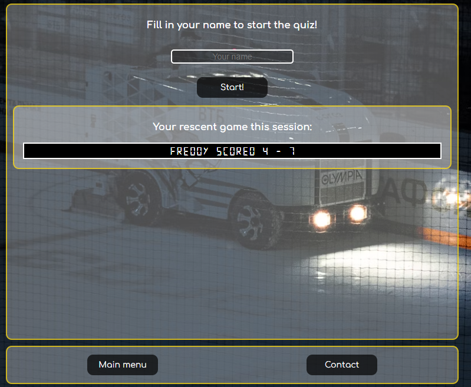
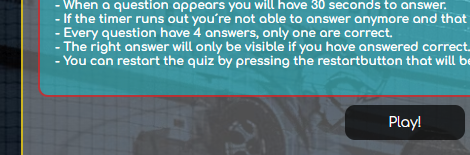
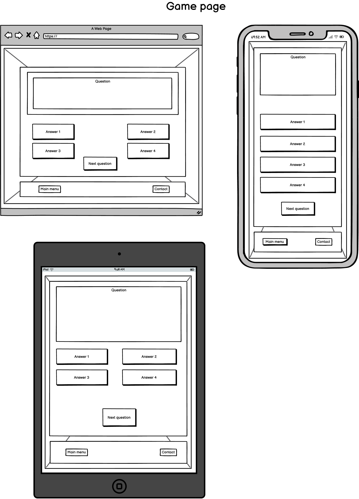

# Hockeyquiz

### Purpose of this quiz
I want this quiz to:  - be fun and educational about the game of hockey.   - be about unique happenings that occur on or off the rink during a hockeyquiz.  - be challenging so when the player guesses wrong, they are not served the correct answer. The player must restart the game and try again to find out the right answer.

[User stories](#user-stories) 
[Features](#features) 
[Flowchart](#flowchart) 
[Future features](#future-features) 
[Typography and color scheme](#typography-and-color-scheme) 
[Wireframes](#wireframes) 
[Testing](#testing) 
[Technology](#technology) 
[Validation](#validation) 
[Bugs](#bugs) 
[Deployment](#deployment) 
[Credits](#credits) 
[Resources](#resources)

# User stories
### First time visitor
As a first time visiting:  - I will have instructions on how this quiz works directly when arriving to the main page. - I can easily find the play button to start the quiz - I can share my feedback about this quiz at the contact page.

### Returning visitor
As a returning visitor:  - I will have new question every game I´m playing the quiz since it´s only picks 11 random questions out of the array. I want to get a higher score than my last visit.

### Frequently visitor
As a frequently visitor:  - I want to challenge myself and win with 11 - 0 to the quiz since the correct answer only shows if you have answered right.

# Features

- ### **Main page:** 
Here the user will find instruction on how this quiz works.  From this page the user can also navigate to main page and contact by clicking the buttons in the footer. 
**Why did I only place the "Play"-button only on the main page?** - I want the user to read the instructions before they start the quiz.  
 

- ### **Contact page:** 
Here the user will find: - form to submit feedback about the quiz - Links to social media of the creator. 
From this page the user can only navigate to the main page by clicking the button in the footer.  
 

- ### **Start the quiz page:** 
Here the quiz wants the user to fill in their name so that can be on the scoreboard when the quiz starts. 
From this page the user can also navigate to main page and contact by clicking the buttons in the footer.  
 

- ### **Quiz page:** 
(1) When the quiz starts a question will be shown, timer will count down from 30 seconds and 4 answering buttons will be shown. 
(2) The name the user put in before will be shown at the scoreboard. 
(3) The score updates when a question has been answered or the timer runs out 
(4) Now their are a restart button visible between "Main menu" and "Contact".  (5) Clicking on one of these 3 buttons (Main menu/Restart/Contact) during the quiz will ask the user if really want to leave? If the match has ended there will be no question asking the user if they want to leave. 
(6) When the quiz has ended the user will get a message if they won or lost the match against the quiz 
  

# Flowchart
- Before I began with this quiz, I made a flowchart manually at home. Underneith you can see how this game runs.
   

# **Future features**
- I would like to improve this quiz with a function where visitors can send in questions that I can review and paste to the game
- A High score list

# **Typography and color scheme**

### **Fonts:**
  
- For all the text on this site I´ve used the font called ["Comfortaa"](https://fonts.google.com/?preview.text=Hockeyquiz&query=comfortaa).
  
- For the scoreboard and timer the font called ["Digital numbers"](https://www.cdnfonts.com/digital-numbers.font). This font makes the scoreboard look very similar to a old style scoreboard.

### **Color scheme**
- For the colors on this site I wanted it to look very similar to the colors used on the ice in a hockey arena. 
- All text on this site are in white (#FFFFFF) except for the scores, timer and win/loss title at the end of the quiz.  
  
- The background on the main div and the footer are the rgba code (rgba(255, 255, 255, 0.3);) This color representing the ice. 
- The border on the main div/footer/next question/timer are the rgba code (rgba(255, 217, 0, 0.692);). This color representing the lower part on the boards around the ice.
- The background in the instruction div and contact form are the rgba code (rgba(0, 238, 255, 0.349);). This color representing the goalies area in front of the net.
- The border around the instruction div and contact form are the rgba code (rgba(255, 0, 0, 0.644);) this color are also used on social media links and the loss message at the end of the quiz. This color are representing the redlines on the ice.
- The buttons on the site are representing pucks with (rgba(0, 0, 0, 0.692);) as background and a hovering effect with the color (rgba(199, 199, 199, 0.623);). 
  
- The font colors for the players score are (#15ff00) and for the quiz score (#ff0000).
- The scoreboard/timer/question have black (#000000) as background so the content inside are easy to read with the white text (except timer that has #fbff00 as font color).
- The answerbuttons background are (rgba(59, 59, 59, 0.623);) with a the border color (rgba(0, 26, 255, 0.692);) representing the blue lines on the ice.
- The right answers buttons colors are (rgba(0, 255, 21, 0.623);) for the background and (rgba(0, 255, 21, 0.897);) for the border.
- The wrong answers buttons color are (rgba(255, 0, 0, 0.623);) for the background and (rgba(255, 0, 0, 0.897);) for the border.
- The win div at the end of the quiz has a black background (#000000) and (rgba(0, 255, 21, 0.897)) as border color and heading text.
- The loss div at the end of the quiz has a black background (#000000) and (rgba(255, 0, 0, 0.644);) as border color and heading text.

# Wireframes
Used Balsamiq to do the wireframes before i started coding this quiz.
Here are my first blueprints on how I wanted this quiz to look.  
 
 
 

# Testing

- All manual tests has been done in Google Chrome and on following devices: - Samsung Galaxy S23 Ultra - Laptop with resolution 1920x1080 - Galaxy tab A8

`Home Page`

| Feature | Expected Outcome | Testing Performed | Result | Pass/Fail |
| --- | --- | --- | --- | --- |
| Contact button | Directed to contact page | Clicked on Contact | Contact page was loaded | Pass |
| Main menu button | No other page shall be visual | Clicked on Main menu | Nothing happened | Pass |
| Play button | Directed to name input page | Clicked on Play | Name input was loaded | Pass |

`Name input`

| Feature | Expected Outcome | Testing Performed | Result | Pass/Fail |
| --- | --- | --- | --- | --- |
| Leaving namefield empty | Message be shown when left empty | Left the field empty and clicked Start! | Message told me to fill in my name | Pass |
| Start the quiz | Question should be displayed when I have filled in a name | Filled in a name and clicked Start! | A question was shown and the quiz started | Pass |
| Main menu | Directed back to home page | Clicked on Main menu | Home page was loaded | Pass | 
| Contact | Directed to contact page | Clicked on Contact | Pass |
| Rescent score | Rescent score on this device shall be shown | Played a game and got out of the page then back to this page | Last played score was shown | Pass |
| No game played | Instead of rescent game, a message shall be shown that no game has been finished | Cleared cache and enter quiz page again | Message was shown | Pass |s 

`Quiz page`

| Feature | Expected Outcome | Testing Performed | Result | Pass/Fail |
| --- | --- | --- | --- | --- |
| Name to scoreboard | The name I filled in before starting  shall be visual on scoreboard | Filled in a name and clicked start | The name was on the scoreboard vs. quiz | Pass |
| Timer start countdown from 30 | When quiz starts, the timer shall begin at 30 | Clicked start  | When quiz started the timer started at 30 | Pass |
| Question displays | When quiz starts a random question from the array shall be shown with answer options | Clicked start | A random question from the array  was displayed when quiz started | Pass
| Answering right | - Timer shall stop  - Only selected answer shall change color (green)  - Point to user - All answers shall be blocked - Button for next question shall be visible | Clicked on right answer | - Timer stopped  - Answer changed to green  - Point was given to user - All answered was blocked - Button for next question was shown | Pass |
| Answering wrong | - Timer shall stop  - Only selected answer shall change color (red)  - Point to quiz - All answers shall be blocked - Button for next question shall be visible | Clicked on wrong answer | - Timer stopped  - Answer changed to red  - Point was given to quiz - All answered was blocked - Button for next question was shown | Pass |
| Timer runs out | - All answer should be blocked - Point to quiz - Button for next question shall be visible | Let the timer run out | - All answer was blocked - Point was given to the quiz - Button for the next question was shown | Pass |
| Quiz stops after 11th question | Since there is more question in the array than 11,  button for next question shall not be shown  when answered the 11th question | Answered 11th question | Button for next question wasn´t shown | Pass |
| Winning against the quiz | Score more than the quiz and a win message shall be shown | Won against the quiz | Message that I won the quiz against the quiz | Pass |
| Loosing to the quiz | Score less than the quiz and a loss message shall be shown | Loosing to the quiz | Message that I lost to the quiz | Pass |
| Main menu (during the quiz) | If 11 questions haven´t been answered: I will be asked if I´m sure to leave? Answering yes will direct me back to main menu. Cancelling should bring me back to the quiz. | Clicked Main menu  (during the quiz) | I was asked to leave the quiz or not Clicked yes and was directed back to the main menu Cancelled the message and the quiz continued | Pass |
| Main menu (quiz ended) | When 11 questions have been answered: I won´t be asked to leave and directed back to main menu | Clicked Main menu  (when quiz finished) | I wasn´t asked to leave the quiz and got back to main menu | Pass |
| Contact (during the quiz)| If 11 questions haven´t been answered  I will be asked if I'm sure to leave Answering yes will direct me to the contact page Cancelling should bring me back to the quiz | Clicked Contact  (during the quiz) | I was asked to leave the quiz or not Clicked yes and was directed to the contact page Cancelled the message and the quiz continued | Pass |
| Contact (quiz ended)| When 11 questions have been answered  I won´t be asked if I'm sure to leave. | Clicked Contact  (when quiz ended) | I wasn´t asked to leave the quiz and the contact page was shown | Pass |
| Restart (during the quiz) | If 11 questions haven´t been answered  I will be asked if I´m sure to leave Answering yes will restart the quiz Cancelling should bring me back to the quiz | Clicked Restart  (during the quiz) | I was asked to leave the quiz or not Clicked yes and the quiz restarted with the scoreboard reset Cancelled the message and the quiz continued | Pass |
| Restart (quiz ended) | If 11 questions have been answered  I won´t be asked if I´m sure to leave and the quiz shall restart | Clicked Restart  (quiz ended) | I wasn´t asked to leave the quiz or not  and the quiz restarted with the scoreboard reset | Pass |

`Contact page`

| Feature | Expected Outcome | Testing Performed | Result | Pass/Fail |
| --- | --- | --- | --- | --- |
| Facebook link | When clicking on the facebook symbol: the profile of the maker will be shown in a new window | Clicked on the facebook logo | The facebookprofile of the creator was opened in a new window | Pass |
| Instagram link | When clicking on the facebook symbol: the profile of the maker will be shown in a new window | Clicked on the instagram logo | The instagramprofile of the creator was opened in a new window | Pass |
| Name input | Check if namefield has been filled  If empty a message will be shown and tell the field was empty | Left the namefield empty and press send | A message told me to fill in the name | Pass |
| Email input empty | Check if emailfield has been filled If empty a message will be shown and tell the field was empty | Left the emailfield empty and press send | A message told me to fill in an email | Pass |
| Email validation | Check if a valid email has been filled If unvalid a message will be shown and tell to fill in a valid email | Filled in a valid & unvalid email | When unvalid email was filled in the field,  a message told me to fill in a valid email. When a valid email was filled in the field, no message was shown to me | Pass |
| Message input | Check if message has been filled If empty a message will be shown tell the message was empty | Left messagefield empty | A message told me to fill in the message | Pass |
| Sending feedback | If all inputs have been filled correctly a message will thank and also a thank you email will be recieved in senders inbox | Filled in all fields correctly and clicked send | A message thanked me and I´ve also got a thank you email in my inbox | Pass |

# Technology

- Languages - HTML, CSS and JavaScript 
- Visual Studio Code - For coding 
- Github pages - To deploy this site
- Fontawesome - To display social media icons
- Emailjs - When submitting the contactform mail will be sent and confirmation sent back to user

# Validation

### **Lighthouse** 

### **HTML** 

### **JSHint** 
**style.js**
- JSHint discovered 3 problems in style.js: - questions are in a separate file (question.js) - emailjs are defined in index.html - sendEmail are used by an onclick in index.html
    
**question.js** 
- JSHint discovered 1 problem in question.js - question are used in style.js 

# Bugs 
### **These are the bugs that have been encountered**
- **Choosing the wrong answer displayed all answer if they are right or wrong** - This wasn´t something that I wanted to happen. Because if the player is shown the answer, the player will most likely not play again. I want the player to find interest in playing again and trying to figure out the answer in the next game they are playing. Also this makes the quiz more difficult. **The solution:** - By adding the function "selectAnswer(e)" I´ve managed to only show if the selected answer was right or wrong.

   
- **When holding the phone horizontally, divs overlaps** - When I tested this page horisontally in devtools (Galaxy fold) and manually on my phone and tablet the divs on the contact page and when you played the quiz overlaps. **The Solution:** - Done nothing to improve that because if the user holds the phone or tablet upright all the content will be displayed as it should be. (Hopefully the user will figure that out)     

# Deployment

- **Visual Studio Code:**
1. Installed extension "GitHub Pull Requests".
2. Connected my Github account to Visual Studio.
3. Used command "Git:Clone" and pasted my repository address, now I´m connected to my repository.
4. "Git add ." | "Git commit -m" | "Git push" | Was commands used in Visual Studio to upload my files to my repository

- **Github:** 
1. Logged in to Github account.
2. Got to the repository for the site. 
3. Clicked on "settings" in the menu at the top. 
4. In settings, located "Pages" on the left-side navigation.
5. On the dropdown under "Source" selected "main" as branch and pressed save.  
Live link: https://profess0ro.github.io/hockeyquiz/

# Credits 

- https://github.com/bezebee/My-First-Project/blob/main/README.md#manual-testing - Bezebee, for a great README that help me.
- https://www.youtube.com/watch?v=riDzcEQbX6k - Web Dev Simplified, for a great tutorial on the basic structure of the quiz.
- https://www.youtube.com/watch?v=BgVjild0C9A - CodeEasy, for helping me get the contact form to function properly.

# Resources
- Javascript codes: https://www.w3schools.com/ and https://codeinstitute.net/ 
- Background image: https://unsplash.com/
- Header image: https://www.pexels.com/sv-se/
- Favicon: https://favicon.io/emoji-favicons/ice-hockey/
- Facts to the questions:  - https://thehockeywriters.com/the-strangest-things-to-ever-happen-in-an-nhl-quiz/ - https://russianmachineneverbreaks.com/2024/04/07/joonas-korpisalo-blinded-by-sun-capitals-senators-quiz-paused/ - https://www.mkewithkids.com/post/hockey-fun-facts/ - https://sportlobby.se/hockey/10-fakta-om-hockey-du-aldrig-hort-talas-om/ - https://www.electro-mech.com/team-sports/hockey/10-most-bizarre-ice-hockey-incidents/ - https://thehockeynews.com/news/nhlers-with-bizarre-birthplaces - https://www.sportskeeda.com/us/nhl/5-nhl-players-played-teams-feat-mike-sillinger 